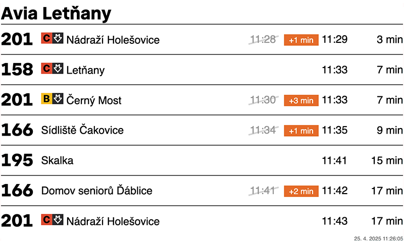
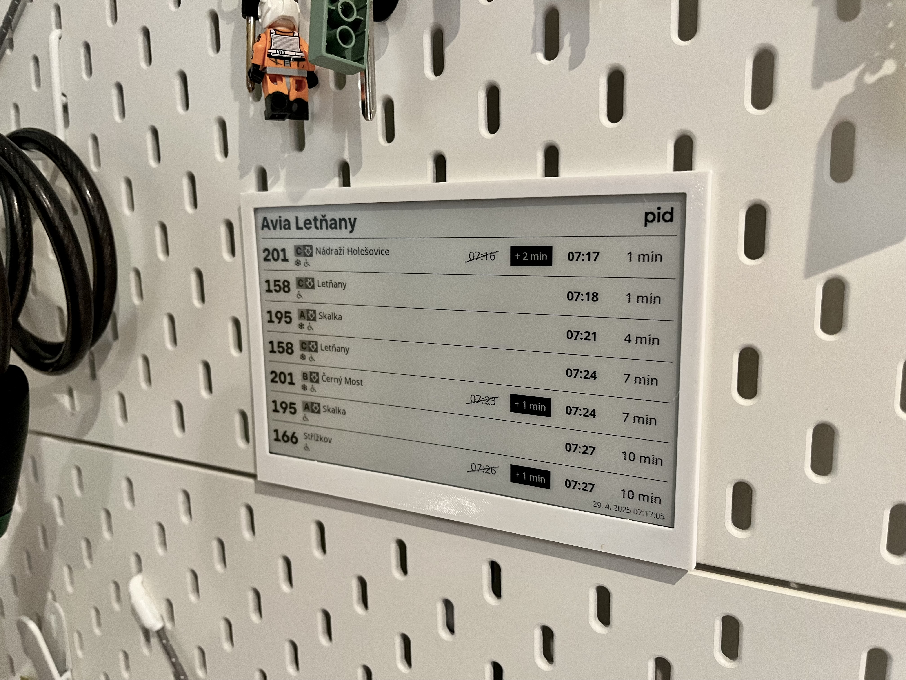

## PID e-ink Board - local side (python on rPi)
- This is second part of that project, see also [first part - local on rPi](https://github.com/dariokolar/PIDeink-server).

## Introduction
- This project obtain power limitation of raspberryPi Zero (rPi)
- Via this python script, we can download pre-generated image from url and display it on eink
- This is fork of library provided by manufacturer - [Waveshare](https://www.waveshare.com/wiki/7.5inch_e-Paper_HAT_Manual#Python)

## HW/SW needed
- [raspberryPi Zero with HAT](https://rpishop.cz/535843/raspberry-pi-zero-2-w-s-pripajenym-gpio-headerem/)
- [Waveshare 7.5" e-Paper display](https://rpishop.cz/e-paper-karty-hat/1049-waveshare-75-epaper-display-for-raspberry-pi.html)
- server that runs PHP with Imagick
- (optional) 3D printed frame for our display (stl of one that can be used on IKEA Skadis pegboard is avalible on [printables](https://www.printables.com/model/1321105-skadis-frame-for-waveshare-75-e-paper-display))

## Basic workflow
1. cron on rPi runs [python](https://github.com/dariokolar/PIDeink-rPi) script every minute
2. that script will request image from our server via url
3. server will request Prague Public Transport api and get current departure data
4. server will create image of departure board with that current data and display it
5. python script on rPi will download that image and send it on e-ink display (with use of manufacturer python library)

## Run demo
Install the function library:
<pre>sudo apt-get update
sudo apt-get install python3-pip
sudo apt-get install python3-pil
sudo apt-get install python3-numpy
sudo pip3 install spidev</pre>
Install gpiozero library (it is installed in the system by default, if not, you can install it by following the commands below)
<pre>sudo apt-get update
# python3
sudo apt install python3-gpiozero
</pre>
Download the demo via GitHub (You can skip this step if you have downloaded it.):
<pre>git clone https://github.com/waveshare/e-Paper.git
cd e-Paper/RaspberryPi_JetsonNano/
Download the demo (You can skip this step if you have downloaded it.):
wget https://files.waveshare.com/upload/7/71/E-Paper_code.zip
</pre>
unzip E-Paper_code.zip -d e-Paper
<pre>cd e-Paper/RaspberryPi_JetsonNano/
cd e-Paper/RaspberryPi_JetsonNano/</pre>
Copy demo script from this repository to python/examples/ and run the demo
<pre>
# Make sure it's in e-Paper/RaspberryPi_JetsonNano/
cd python/examples/
python3 epd_7in5_V2_test.py
</pre>

